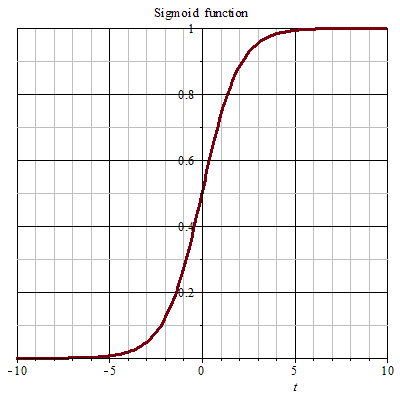
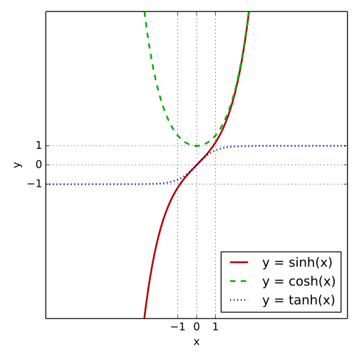
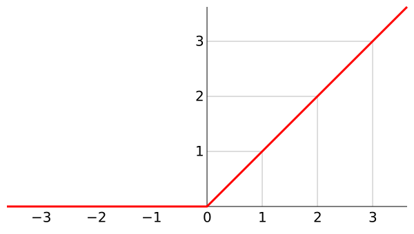

# cost functions

Cost function is the target we optimise. In the concept of supervised learning, we want our algorithm to predict right answer as much as possible, but not overfitting. The cost function describes the error between the algorithm's result and the label result for all the training samples.

## quadratic/MSE
MSE(mean squared error)

$$ MSE = \frac{1}{2m}\,\sum_{i=1}^{m}(h_{\theta}(x^{(i)}) - y^{(i)})^2 $$

m: number of training example.

$ x^{(i)} $ : the ith training example.

$ y^{(i)} $ : the ith result.

$ h_{\theta}(x^{(i)}) $ : the predicted value for ith training example.

## cross-entropy

[cross-entropy wiki](https://en.wikipedia.org/wiki/Cross_entropy)

$$ H(p,q)=-\sum _{x}p(x)\,\log q(x).\! $$

# neurons

Neurons is the basic unit in NN, it simulate the human's neural system. In human's neural system, only the circut meets specific threshhold, the signal can be sent. In NN, using activation function is like processing the threshhold, it makes the data simpler.

## perceptron

It maps its input to 0 or 1.

$$ {\displaystyle f(x)={\begin{cases}1&{\text{if }}\ \mathbf {w} \cdot \mathbf {x} +b>0\\0&{\text{otherwise}}\end{cases}}} $$

w : a vector of real-valued weights.
x : a real-valued vector.

## sigmoid

It maps the value to (0, 1) 

$$ {\displaystyle S(t)={\frac {1}{1+e^{-t}}}} $$

## tanh

It maps the value to (-1, 1) 

$$ {\displaystyle tanh = \frac{e^u - e^{-u}}{e^u + e^{-u}}} $$

## ReLU

It mapps values less than 0 to 0.

$$ {\displaystyle f(x)=\max(0,x)} $$ 

# gradient descent

Gradient descent is a very useful method, we use it to find the optimal or local optimal result. Since the value is going down most along gradient direction, so the parameter is updated by minus the gradient with learning rate.

## learning rate
## mini-batch size
## second-order(Adam)

# reduce overfitting

In machine learning, overfitting is a common problem. We don't want the algorithm only performs good in training data, we want it to have the extensibility on new datasets. If the algorithm learns very well on the training dataset, it may lose the extensibility on unknown data. There are some methods to reduce the overfitting.

## L1/L2 reg.
## dropout

Dropout especially used in neural network, it is to randomly drop out some units. For more detailed explanition, please reference the [blog in medium](https://medium.com/@amarbudhiraja/https-medium-com-amarbudhiraja-learning-less-to-learn-better-dropout-in-deep-machine-learning-74334da4bfc5).

* expand data

# initiatization
* Glorot

# layers
* dense
* softmax
* max-pooling
* flattern
* convolutional
* deconvolutional
* upsampling
